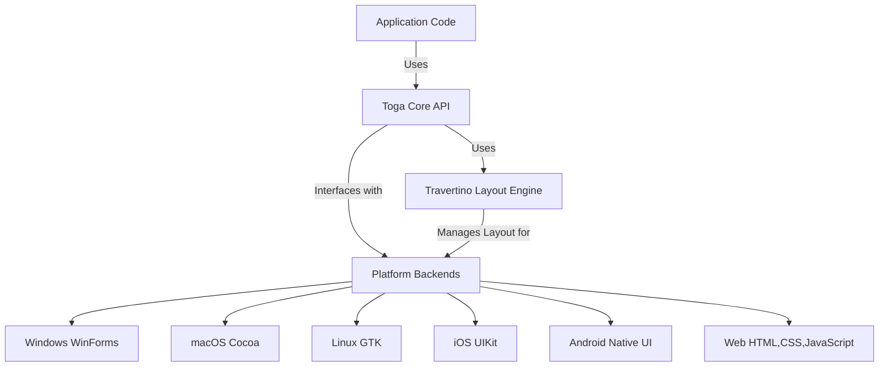

# Arcitecture overview (1. & 2.) for P+

## Purpose of Toga (P+ 1.)
Toga is a cross-platform graphical user interface (GUI) that is designed to allow developers to build native applications with Python. It is a part of the BeeWare project, which is an open-source collection of tools and libraries that allow for writing and deploying applications on multiple platforms using Python. Toga makes it possible to write applications once and deploy them on Windows, macOS, Android, Linux, and iOS. It uses each platform's native widgets which allow the applications to look consistent across each of the operating systems. 

The purpose of Toga is to allow Python developers a way to build native applications without knowing multiple GUI frameworks across different platforms. This makes it possible to develop applications that are lightweight and flexible across different operating systems. 

## System Arcitecture

Toga contains a CoreAPI which allows for high-level abstraction of UI elements across platforms. It supports native GUI toolkits for 6 different operating systems. The bridging layer allows the applications to function uniformly across the different operating systems. Recently, Toga implemented the use of the Travertino Library which allows for a flexible management system for UI elements so they can be consistent and adapted across the different platforms. A diagram of the Toga architecture is shown below. 

## Updates in context (P+ 2.)
Our implementation of the Toga issue **Support CSS font-size keywords** allowed for better uniformity across platforms for font size and supporting the use of CSS keywords such as *small, medium, large* and relative font size like *smaller, and larger*. We added the font size choices into `core/src/toga/style/pack` to have the keywords accessible. Since each operating system had its own default sizes and naming conventions, we needed to split up the work for each of the operating systems. We each took one operating system to implement the CSS font-size keyword handling and updated the tests to ensure that they passed and had full coverage. Within each operating system, we updated the Font source code to change the font size accordingly. We also updated the operating system-specific font-size tests. In order to properly test that our implementations were correct, we updated the CoreAPI tests in `core\tests` to ensure that each keyword was being tested with the font tests. 
