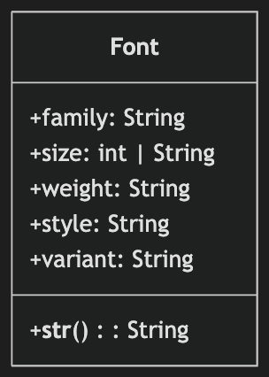
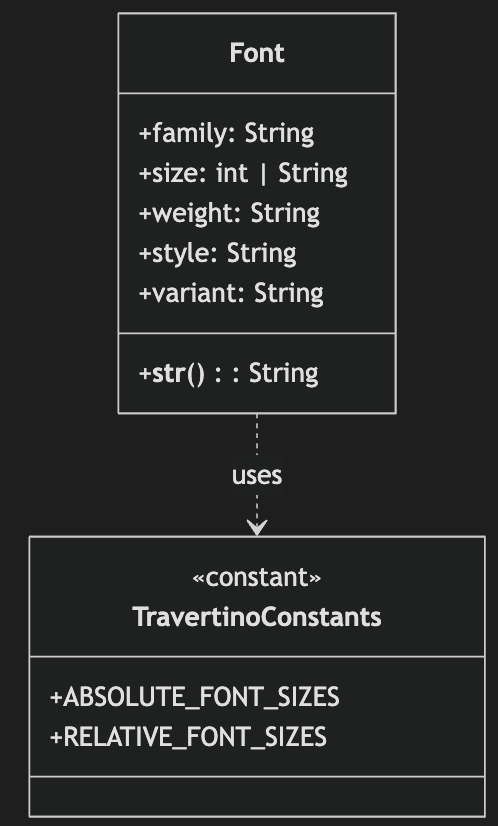
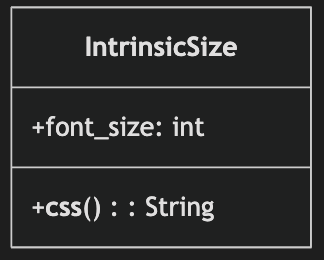
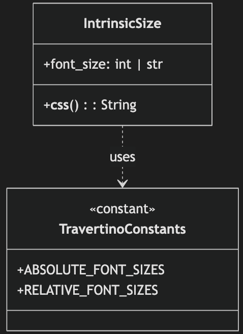
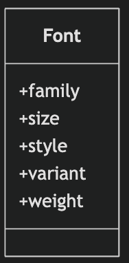
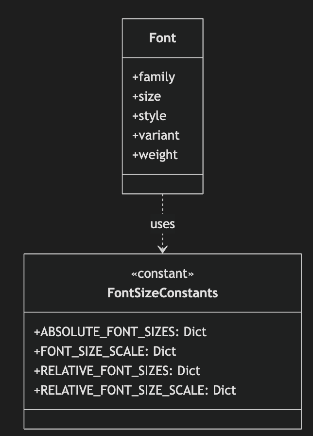
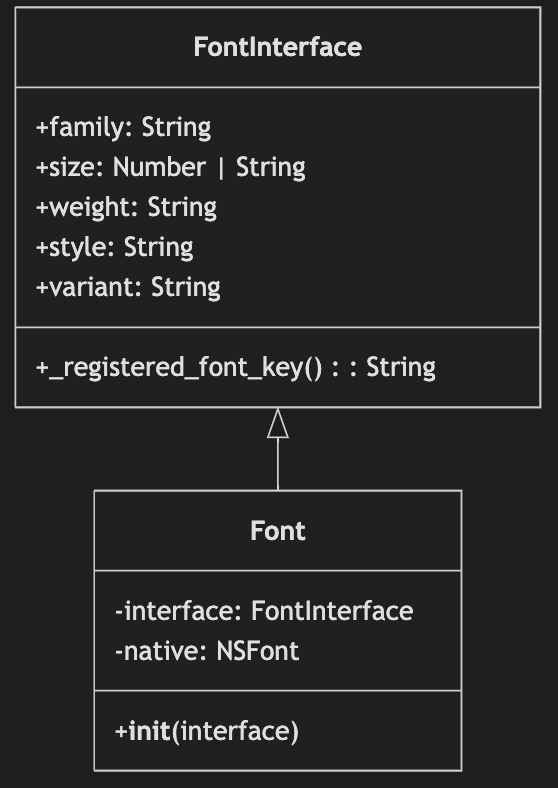
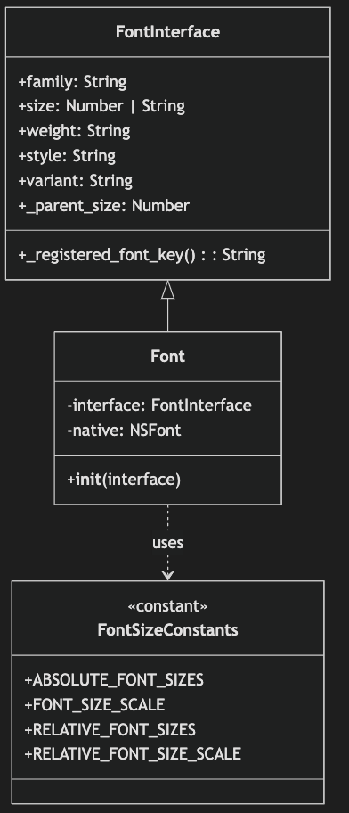
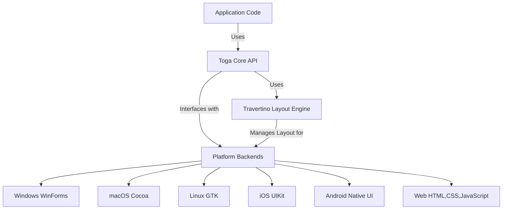

# Report for assignment 4

## Project

Name: Toga

URL: https://github.com/beeware/toga

Toga is a GUI toolkit to aid in creating applications for various platforms.

## Onboarding experience

### Did you choose a new project or continue on the previous one?

We switched to a new project, as the previous one (discord.js) wasn't as fitting for the assignment - and comes with higher stakes & complexity. Toga ([beeware/toga](https://github.com/beeware/toga)) had a comprehensive test suite which was easy to set up, and the project structure was very well documented. The project as a whole seems very inviting to contribute to, with documentation on how to get started with the process of contributing. There are also many open issues that are well suited for newcomers to contribute to, some with a "good first issue" label. We looked through these issues and found one that we thought was interesting and suitably scoped for our assignment. It was a relatively big issue, but it was conveniently split into five smaller tasks which made it easier to handle for our five-person group. Toga is a Python library that is used to create GUI applications for various platforms, and we chose to work on the issue of supporting CSS font size keywords - this meant that each person could work on one of the five backends (Android, iOS, Windows, Cocoa, GTK).

### If you changed the project, how did your experience differ from before?

Overall, it was a better experience working on this project compared to discord.js, mostly because of the comprehensive test suite, the well-documented contribution guide, and the contribution-focused nature of the project. It was also easier to comprehensively test our changes as the project is offline and not reliant on external APIs.

#### Work distribution & testing

Within the team, we have a perfect distribution of machines for the backends - 2 Macs (iOS and Cocoa), 2 Windows (Android and Winforms), and 1 Linux (GTK). This made it easy to test our changes on all platforms. Toga has a collection of different tests for various parts of the project, including the core, travertino, and tests for each backend - for every change we made, we could run the tests to ensure that we didn't break anything. Of course, every person only tested their own backend, but we made sure the tests passed for each backend before submitting our PRs into our development repo, which has been submitted as a PR to the main repo. Since Toga also has a CI pipeline, we made sure that these passed as well, which gave us confidence that our changes were correct.

#### Cache issues

One thing that took us a while to figure out, though, was that, if we made changes to some part of the codebase, we had to remove the build cache for that part of the codebase before we could test it. Otherwise, the tests would still use the old code. This was a bit annoying, and cost us some time, but once we figured it out, it was a non-issue.

## Effort spent
| topic                 | Carl | Klara | Jacob | Phoebe | Samuel |
| --------------------- | ---- | ----- | ----- | ------ | ------ |
| discussions/meetings  | 5    | 5     | 5     | 5      | 5      |
| reading documentation | 3    | 2     | 3     | 3      | 2      |
| configuration/setup   | 8    | 5     | 6     | 3      | 3      |
| analyzing code/output | 16   | 3     | 8     | 7      | 3      |
| writing documentation | 1    | 4     | 1     | 3      | 2      |
| writing code          | 3    | 2     | 5     | 6      | 6      |
| running code          | 8    | 4     | 2     | 6      | 4      |
| total                 | 44   | 25    | 30    | 33     | 25     |

## Overview of issue and work done.

Title: Support CSS font size keywords

URL: https://github.com/beeware/toga/issues/1814

This issue is to make sure that the font size keywords (`xx-small`, `x-small`, `small`, `medium`, `large`, `x-large`, `xx-large`, `smaller`, `larger`) can be used to make it easier to create text among the 5 different backends. There are 5 architectures supported: Android, IOS, Windows, Cocoa, and GTK. These changes also need to be compatible with the testing infrastructure already in place.

## Requirements for the new feature

| Requirements                | ID  | Description                                                                                                                                                              | Linked requirement                                                                                                                                                                                                                                                                                                    |
| --------------------------- | --- | ------------------------------------------------------------------------------------------------------------------------------------------------------------------------ | --------------------------------------------------------------------------------------------------------------------------------------------------------------------------------------------------------------------------------------------------------------------------------------------------------------------- |
| Android Requirements        |
| 1                           | R1  | The system should allow keywords for specifying font sizes in Android. Both relative and absolute CSS keywords are represented and supported.                            | [R1 file](https://github.com/DD2480-Group22-2025/toga/blob/main/android/src/toga_android/fonts.py)                                                                                                                                                                                                                    |
| 2                           | R2  | There should be testing for Android font size keywords. Ensure that the absolute keywords and relative keywords change font-size by ~20\% with each step.                | [R2 test](https://github.com/DD2480-Group22-2025/toga/blob/main/android/tests_backend/fonts.py)                                                                                                                                                                                                                       |
| Cocoa Requirements          |
| 3                           | R3  | The system should allow keywords for specifying font sizes in Cocoa. Both relative and absolute CSS keywords are represented and supported.                              | [R3 file](https://github.com/DD2480-Group22-2025/toga/blob/main/cocoa/src/toga_cocoa/fonts.py)                                                                                                                                                                                                                        |
| 4                           | R4  | There should be testing for Cocoa font size keywords. Ensure that the absolute keywords and relative keywords change font-size by ~20\% with each step.                  | [R4 test](https://github.com/DD2480-Group22-2025/toga/blob/main/cocoa/tests_backend/fonts.py)                                                                                                                                                                                                                         |
| GTK Requirements            |
| 5                           | R5  | The system should allow keywords for specifying font sizes in GTK. Both relative and absolute CSS keywords are represented and supported.                                | [R5 file](https://github.com/DD2480-Group22-2025/toga/blob/main/gtk/src/toga_gtk/fonts.py)                                                                                                                                                                                                                            |
| 6                           | R6  | There should be testing for GTK font size keywords. Ensure that the absolute keywords and relative keywords change font-size by ~20\% with each step.                    | [R6 test](https://github.com/DD2480-Group22-2025/toga/blob/main/gtk/tests_backend/fonts.py)                                                                                                                                                                                                                           |
| iOS Requirements            |
| 7                           | R7  | The system should allow keywords for specifying font sizes in iOS. Both relative and absolute CSS keywords are represented and supported.                                | [R7 test](https://github.com/DD2480-Group22-2025/toga/blob/main/iOS/src/toga_iOS/fonts.py)                                                                                                                                                                                                                            |
| 8                           | R8  | There should be testing for iOS font size keywords. Ensure that the absolute keywords and relative keywords change font-size by ~20\% with each step.                    | [R8 test](https://github.com/DD2480-Group22-2025/toga/blob/main/iOS/tests_backend/fonts.py)                                                                                                                                                                                                                           |
| Windows Requirements        |
| 9                           | R9  | Allow keywords for specifying font sizes in Windows                                                                                                                      | [R9 file](https://github.com/DD2480-Group22-2025/toga/blob/main/winforms/src/toga_winforms/fonts.py)                                                                                                                                                                                                                  |
| 10                          | R10 | There should be testing for Windows font size keywords. Ensure that the absolute keywords and relative keywords change font-size by ~20\% with each step.                | [R10 test](https://github.com/DD2480-Group22-2025/toga/blob/main/winforms/tests_backend/fonts.py)                                                                                                                                                                                                                     |
| General System Requirements |
| 11                          | R11 | The travertino libary should support and test the use of CSS keywords `xx-small`, `x-small`, `small`, `medium`, `large`, `x-large`, `xx-large`, `smaller`, and `larger`. | [R11 constants](https://github.com/DD2480-Group22-2025/toga/blob/main/travertino/src/travertino/constants.py), [R11 file](https://github.com/DD2480-Group22-2025/toga/blob/main/travertino/src/travertino/fonts.py), [R11 test](https://github.com/DD2480-Group22-2025/toga/blob/main/travertino/tests/test_fonts.py) |
| 12                          | R12 | The CoreAPI should support and test the use of CSS keywords `xx-small`, `x-small`, `small`, `medium`, `large`, `x-large`, `xx-large`, `smaller`, and `larger`.           | [R12 file](https://github.com/DD2480-Group22-2025/toga/blob/main/core/src/toga/style/pack.py), [R12 test](https://github.com/DD2480-Group22-2025/toga/blob/main/core/tests/style/pack/test_css.py)                                                                                                                    |

## Changes made

We made changes to 20 files in total, spanning over the CoreAPI, Travertino library, Testbed suite, and the 5 different backends each of us refactored. Expand the dropdowns below to see the side-by-side changes to each of the files. 

 

CoreAPI

`core/src/toga/stype/pack.py`

`core/src/toga/fonts.py`

`core/tests/test_fonts.py`

`core/tests/style/pack/test_css.py`

 

Testbed

`testbed/tests/test_fonts.py`

 

Travertino

`travertino/src/travertino/constants.py`

`travertino/src/travertino/fonts.py`

`travertino/tests/test_fonts.py`

 

Backend Changes

`android`

`cocoa`

`gtk`

`ios`

`windows`

 

Commit History

  

We also wrote a patch note:

Link: [file](https://github.com/DD2480-Group22-2025/toga/blob/main/changes/1814.misc.rst)

We also made changes to the docs, reflecting this new feature:

Link: [file](https://github.com/DD2480-Group22-2025/toga/blob/main/docs/reference/style/pack.rst)

## Test results

The test results in toga are very well written with many assertions. This project contains 100% coverage report with over 2743 tests for the CoreAPI and 645 tests for Travertino written. By running testing through `tox -m test` it runs both of the testing suites (`core` and `travertino`) and outputs the coverage results. We also ran the CI pipeline each time we made a pull request. The original CI pipeline passed. The original results are pictured below.

 

Original Results

Original test results:

Original coverage reports:

Original CI pipeline results:

During our refactoring process, we created more tests to ensure that our enhancements were correct. To test our specific test updates we ran `briefcase dev --test -- test/path/test_fonts.py` from the `testbed` directory. This gave results for the specific tests relating to fonts over all of the architectures. We also were able to run `briefcase dev --test` which ran all of the tests in the testbed but it takes around 10 minutes to run. 

After refactoring, we were able to increase the number of tests from 2743 to 2757 (+14) and 654 to 663 (+9) for the Core and Travertino test suites! We also ensured that the coverage stayed at 100%. Below we have the results of our testing as well as the final CI pipeline (which passes!) 

 

Refactored Results

Refactored test results:

Refactored coverage report:

Refactored CI results:

We implemented changes in multiple locations of the testbed to ensure that both our enhancements were correct, and so that our coverage remained at 100%. Within each operating system, we added tests to check whether or not the font size was an integer or a string from the `ABSOLUTE_FONT_SIZES` or from the `RELATIVE_FONT_SIZES` and if the size matched what the expected font size should be. We updated the test suites for core and travertino to ensure that each size option (`int`, `ABSOLUTE_FONT_SIZES`, `RELATIVE_FONT_SIZE`, `SYSTEM_DEFAULT_FONT_SIZE`) was tested for each operating system. These changes allowed for us to make sure that our implementations were correct and provided full coverage.

## UML class diagram and its description

 

UML Diagrams for Core Changes

**Core fonts before**

**Core fonts after**

In the updated core Font file (`core/src/toga/fonts.py`), the str method now accepts font sizes as either a number or a CSS keyword. If the size is a CSS keyword (found in `ABSOLUTE_FONT_SIZES` or `RELATIVE_FONT_SIZES`), it outputs that keyword directly; otherwise, it appends "pt" to numeric values. Tests in `core/tests/test_fonts.py` verify that the string representation is correct for both numeric sizes and keywords (e.g., `small`, `large`).

**Core pack before**

**Core pack after**

 

UML Diagram for Travertino Changes

**Travertino fonts before**

**Travertino fonts after**

Travertino is a library for "describing constants and a base box model that can be used to define layout algorithms". In it, constants have been defined for scaling font sizes based on system default sizes. The library defines Font clases which are later used in the Togo core to define fonts. The font class has been altered to recognize and handle `RELATIVE` and `ABSOLUTE` font sizes, otherwise, it remains unchanged.

The `ABSOLUTE_FONT_SIZES` is defined as a dictionary of different available size modifiers {`XX_SMALL`, `X_SMALL`, `SMALL`, `MEDIUM`, `LARGE`, `X_LARGE`, `XX_LARGE`}, where `MEDIUM` is the same size as the system default, while each step up and down either increase or decreases the size by 20 %. `RELATIVE_FONT_SIZES` is a dictionary containing size modifiers {`SMALLER`, `LARGER`}, which indicate that a font is 20 % smaller or larger than that of its parent. 

 

UML Diagram for Backend Fonts Modules

**Backend fonts Before**

**Backend fonts After**

The original font implementation only supported numeric font sizes. It computed the final size by checking if the size was the system default or by converting a numeric CSS value using a fixed multiplier. This is somewhat applicable for all font classes, therefore we do not make one for each. 

The refactored version now supports CSS font-size keywords (like `small`, `medium`, and `large`). The interface was extended to accept string values, and lookup tables (`ABSOLUTE_FONT_SIZES`, `FONT_SIZE_SCALE`, `RELATIVE_FONT_SIZES`, and `RELATIVE_FONT_SIZE_SCALE`) from Travertino are used to convert these keywords into numeric sizes. The updated UML diagram shows that the Font class now leverages these constants to dynamically compute the font size, while still handling numeric values as before, resulting in more consistent font sizing across platforms while following each platform’s UI guidelines.

## Way of working
We began this issue and we originally thought that the changes would not take as much time. Our plan was to finish the first issue in the first week and take a second issue in the second week. However, due to the complexity of the different requirements and testing environments for each of our systems, we continuously ran into problems regarding running the tests and making sure we had compatible systems with the operating systems we were trying to implement. 

Our team is currently in the **Working Well**. We have a good flow together and continuously keep in contact and stay on top of our commitments. In this project, we really worked together and communicated our needs so that we were able to complete the project and help each other if needed. We stuck to the guidelines that we created in the beginning. After this week, we will move to the **Retired** since this is the last project for this course. This means that our responsibilities are done and we will soon move on to new projects with different groups. We have learned a lot about working in a team and have found a system that works well for us. 

We can recognize the benefits and limitations of our work in the context of modern software engineering practices. This approach, which was guided by the SEMAT kernel, helped us maintain industry standards. We found that good documentation was really important for starting to work on already established projects. In our project for P3, the documentation helped our onboarding experience and we were able to quickly set up and move on to our analysis. In this project, while the documentation was really good and clearly stated, it was difficult to find the exact documentation that we needed to read since there were many for different versions that had key differences which were essential for running the tests and the program. Another thing we learned from this work was the importance of good testing. We found that in P3 the lack of testing really made it difficult to analyze the project. In this project, we had really great testing which also came with 100\% code coverage which made it easy to expand on their tests and to ensure that our code implementations and refactorings were correct. 

# Arcitecture overview for P+

## Purpose of Toga (P+ 1.)
Toga is a cross-platform graphical user interface (GUI) that is designed to allow developers to build native applications with Python. It is a part of the BeeWare project, which is an open-source collection of tools and libraries that allow for writing and deploying applications on multiple platforms using Python. Toga makes it possible to write applications once and deploy them on Windows, macOS, Android, Linux, and iOS. It uses each platform's native widgets which allow the applications to look consistent across each of the operating systems. 

The purpose of Toga is to allow Python developers a way to build native applications without knowing multiple GUI frameworks across different platforms. This makes it possible to develop applications that are lightweight and flexible across different operating systems. 

## System Architecture

Toga contains a CoreAPI which allows for high-level abstraction of UI elements across platforms. It supports native GUI toolkits for 6 different operating systems. The bridging layer allows the applications to function uniformly across the different operating systems. Recently, Toga implemented the use of the Travertino Library which allows for a flexible management system for UI elements so they can be consistent and adapted across the different platforms. A diagram of the Toga architecture is shown below. 

## Updates in context (P+ 2.)
Our implementation of the Toga issue **Support CSS font-size keywords** allowed for better uniformity across platforms for font size and supporting the use of CSS keywords such as *small, medium, large* and relative font size like *smaller, and larger*. We added the font size choices into `core/src/toga/style/pack` to have the keywords accessible. Since each operating system had its own default sizes and naming conventions, we needed to split up the work for each of the operating systems. We each took one operating system to implement the CSS font-size keyword handling and updated the tests to ensure that they passed and had full coverage. Within each operating system, we updated the Font source code to change the font size accordingly. We also updated the operating system-specific font-size tests. In order to properly test that our implementations were correct, we updated the CoreAPI tests in `core\tests` to ensure that each keyword was being tested with the font tests. 

