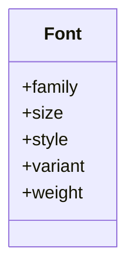
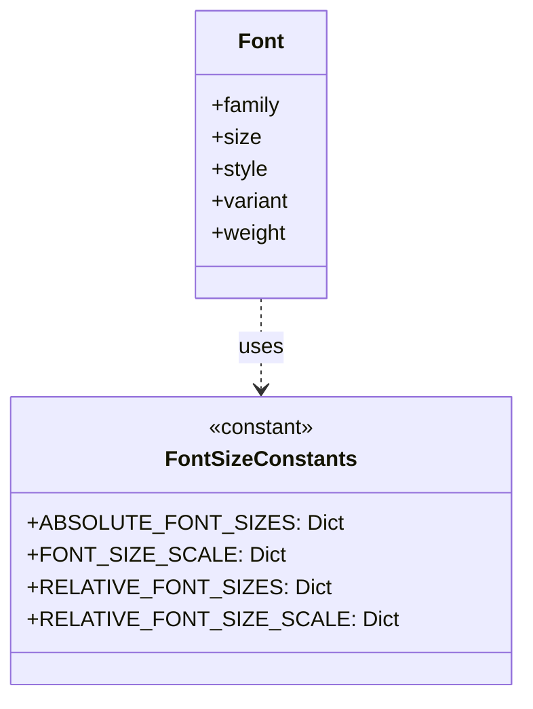
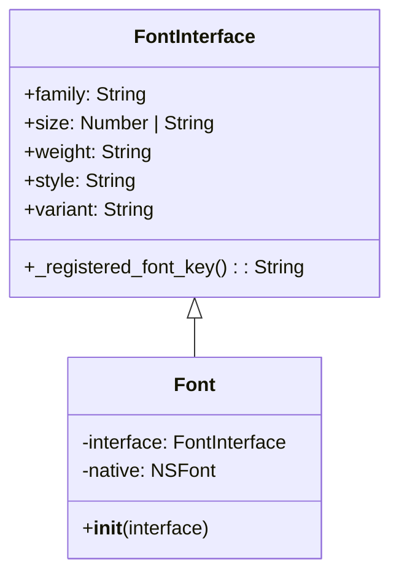
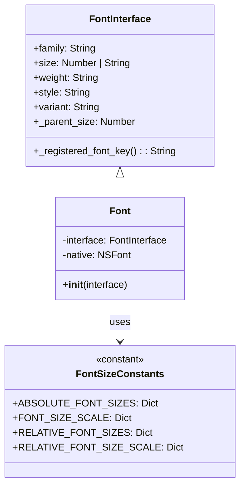

# UML class diagram and its description
## UML Diagram for core tests

## UML Diagram for Travertino Changes
### Travertino fonts before

### Travertino fonts after

Travertino is a library for "describing constants and a base box model that can be used to define layout algorithms". In it constants have been defined for scaling font sizes based on system default sizes. The library defines Font clases which are later used in the Togo core to define fonts. The font class has been altered to recognize and handle RELATIVE and ABSOLUTE font sizes, otherwise it remains unchanged.

The ABSOLUTE_FONT_SIZES is defined as a dictionary of different available size modifiers {XX_SMALL, X_SMALL, SMALL, MEDIUM, LARGE, X_LARGE, XX_LARGE}, where MEDIUM is the same size as system default, while each step up and down either increases or decreases the size by 20 %. RELATIVE_FONT_SIZES is a dictionary containing size modifiers {SMALLER, LARGER}, which indicate that a font is 20 % smaller or larger than that of its parent. 

## UML Diagram for Backend Fonts Modules
### Backend fonts Before

### Backend fonts After

The original font implementation only supported numeric font sizes. It computed the final size by checking if the size was the system default or by converting a numeric CSS value using a fixed multiplier.

The refactored version now supports CSS font size keywords (like “small”, “medium”, “large”). The interface was extended to accept string values, and lookup tables (ABSOLUTE_FONT_SIZES, FONT_SIZE_SCALE, RELATIVE_FONT_SIZES, and RELATIVE_FONT_SIZE_SCALE) from Travertino are used to convert these keywords into numeric sizes. The updated UML diagram shows that the Font class now leverages these constants to dynamically compute the font size—while still handling numeric values as before—resulting in more consistent font sizing across platforms while following each platform’s UI guidelines.
