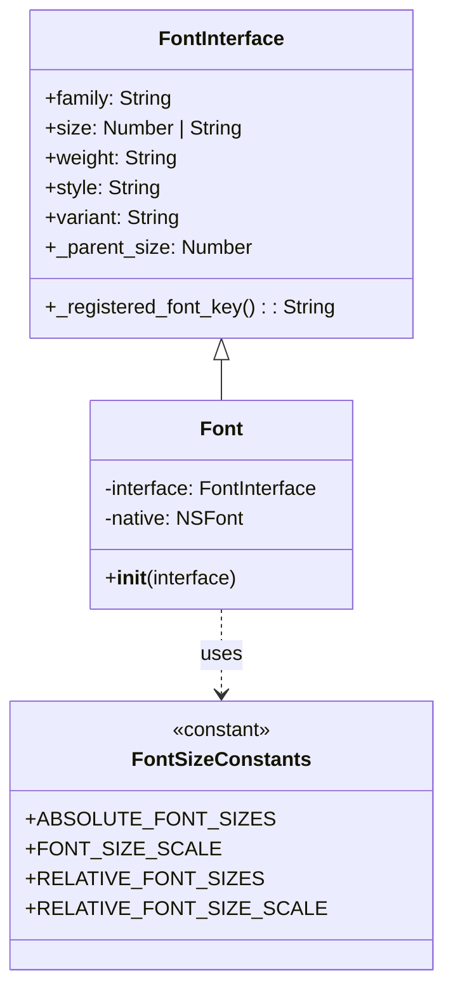

# UML class diagram and its description
## UML Diagram for core tests

## UML Diagram for Travertino Changes
### Travertino fonts before

### Travertino fonts after

## UML Diagram for Backend Fonts Modules
### Backend fonts Before

### Backend fonts After

The original font implementation only supported numeric font sizes. It computed the final size by checking if the size was the system default or by converting a numeric CSS value using a fixed multiplier. This is somewhat appliable for all font clases therefore we do not make one for each. 

The refactored version now supports CSS font size keywords (like “small”, “medium”, “large”). The interface was extended to accept string values, and lookup tables (ABSOLUTE_FONT_SIZES, FONT_SIZE_SCALE, RELATIVE_FONT_SIZES, and RELATIVE_FONT_SIZE_SCALE) from Travertino are used to convert these keywords into numeric sizes. The updated UML diagram shows that the Font class now leverages these constants to dynamically compute the font size—while still handling numeric values as before—resulting in more consistent font sizing across platforms while following each platform’s UI guidelines.
